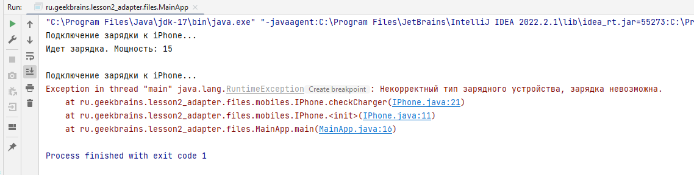
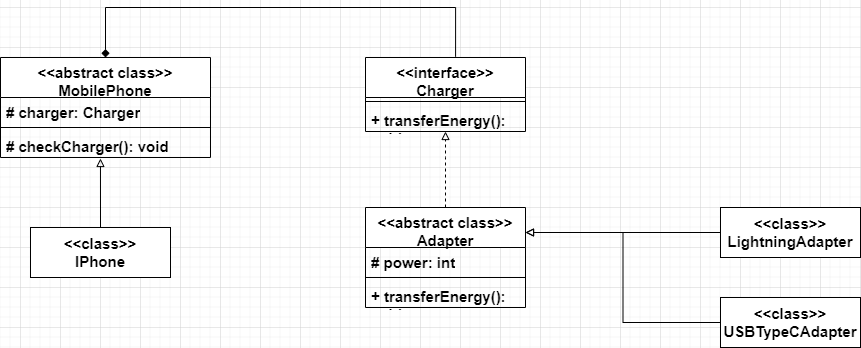

# Задание

#### 1. Разработать UML-диаграмму для демонстрации работы шаблона (ОДНОГО, ЛЮБОГО ИЗ СПИСКА) проектирования Singleton, Builder, Adapter, Facade, Decorator, Proxy, Observer, Mediator ИЛИ ЛЮБОГО ДРУГОГО НА ВАШ ВЫБОР (как мы это делали на семинаре).
#### 2**. Продемонстрировать работу этого шаблона проектирования в вашей программе (как мы это делали на семинаре).

# Решение

### _Реализация паттерна Адаптер(Adapter) на примере мобильных телефонов и подключения к ним ЗУ._

1. Абстрактный класс MobilePhone, зависит от интерфейса Charger, в методе checkCharger() выполняется проверка, каким устройством была попытка зарядить устройство.
2. Интерфейс Charger, имеет один метод transferEnergy()
3. Абстрактный класс Adapter, реализует интерфейс Charger, метод интерфейса остается абстрактным
4. Классы LightningAdapter и USBTypeCAdapter, наследуют класс Adapter, реализуют метод transferEnergy()
5. Пример работы программы в файле MainApp.java

### Результат выполнения программы

### UML-Диаграмма
