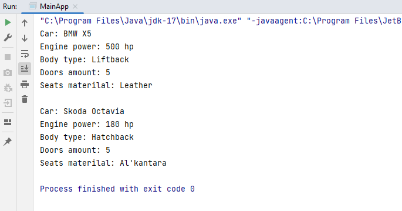
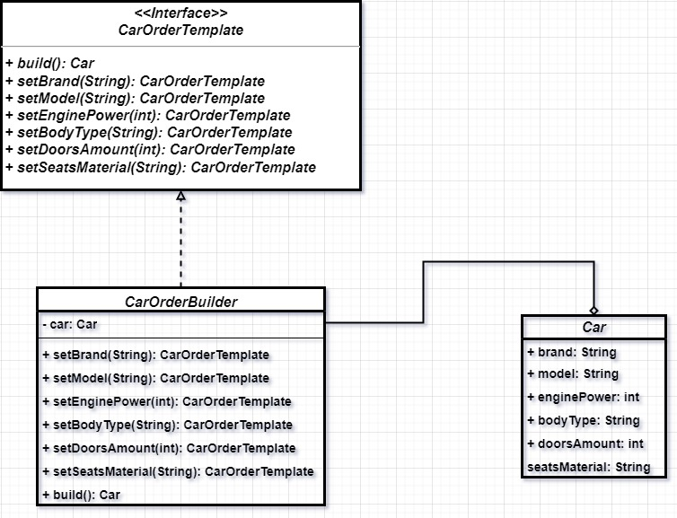

# Задание

#### 1. Разработать UML-диаграмму для демонстрации работы шаблона (ОДНОГО, ЛЮБОГО ИЗ СПИСКА) проектирования Singleton, Builder, Adapter, Facade, Decorator, Proxy, Observer, Mediator ИЛИ ЛЮБОГО ДРУГОГО НА ВАШ ВЫБОР (как мы это делали на семинаре).
#### 2**. Продемонстрировать работу этого шаблона проектирования в вашей программе (как мы это делали на семинаре).

# Решение

### Реализация паттерна Строитель(Builder) на примере заказа автомобиля.

1. Были созданы класс Car - описание автомобиля.
2. Интерфейс CarOrderTemplate, методы которого определяют параметры класса Car
3. Класс CarOrderBuilder, реализующий интерфейс CarOrderTemplate
4. Пример работы программы находится в файле MainApp.java

### Результат выполнения программы

### UML-Диаграмма

